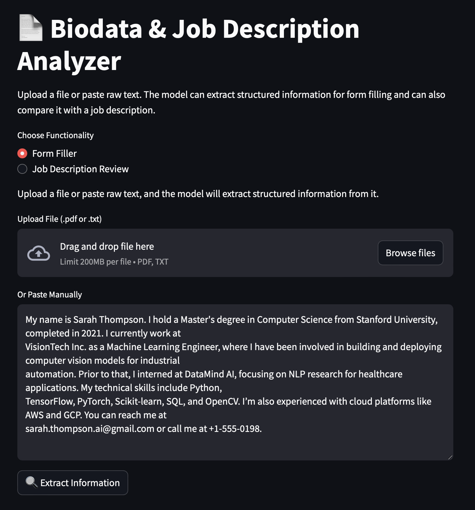
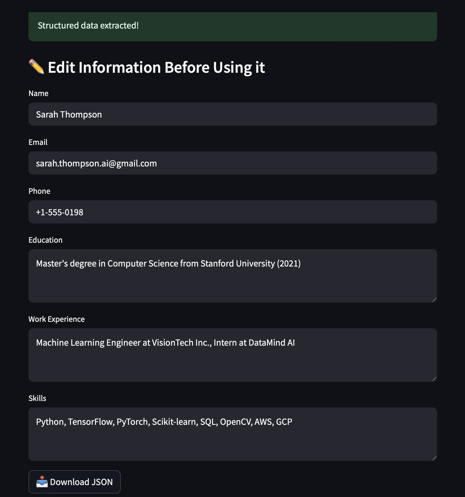
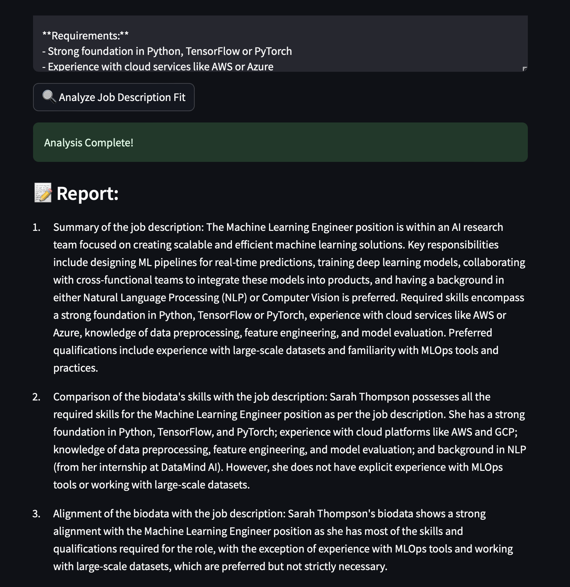

# Biodata & Job Description Analyzer

A Streamlit-based application that extracts structured biodata information from resume/personal information (PDF or text) and performs a job description review to compare the candidate's skills and experience with the job requirements.

## Project Overview

This project uses LangChain to process biodata information and generate structured data. It offers two main functionalities:
- **Form Filler**: Extracts key personal details from a given biodata file or pasted text.
- **Job Description Review**: Compares biodata information with a provided job description and returns an analysis including a summary of responsibilities and key skills.

## Prerequisites

Before running the application, ensure you have the following installed:
- [Miniconda or Anaconda](https://docs.conda.io/en/latest/miniconda.html)  
- [Ollama](https://ollama.com) (Download and install from [ollama.com](https://ollama.com))

## Setup and Installation

1. **Clone the Repository**  
   Clone this project repository to your local machine.

2. **Create Conda Environment**  
   Create a virtual environment using Conda:
   ```bash
   conda create -n formfill python=3.11 -y
   conda activate formfill
   ```

3. **Install Requirements**  
   Use the provided `requirements.txt` to install necessary packages:
   ```bash
   pip install -r requirements.txt
   ```

4. **Download Mistral Model**  
   Make sure you have Ollama installed, then run:
   ```bash
   ollama pull mistral
   ```

5. **Run the App**  
   Launch the Streamlit app:
   ```bash
   streamlit run app.py
   ```

## How to Run the Application Again

Once everything is set up, just activate the environment and run:
```bash
conda activate formfill
streamlit run app.py
```

## Demonstration

### Form Filler



### Analysis Report


